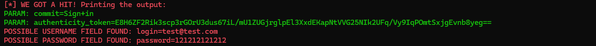

# Phishing para captura de senhas do Github

### Ferramentas

- Kali Linux
- setoolkit

### Configurando o Phishing no Kali Linux

- Acesso root: ``` sudo su ```
- Iniciando o setoolkit: ``` setoolkit ```
- Tipo de ataque: ``` Social-Engineering Attacks ```
- Vetor de ataque: ``` Web Site Attack Vectors ```
- Método de ataque: ```Credential Harvester Attack Method ```
- Método de ataque: ``` Site Cloner ```
- Obtendo o endereço da máquina: ``` ifconfig ```
- URL para clone: https://github.com/login

### Resutados




### Porque o não foi realizado para capturar credenciais no Facebook 

O facebook tem uma defesa atualmente na página de login que quando clona a página, o botão de login vem desabilitado, impossibilitando de submeter o formulário.